# 06 状态机 Mermaid 图集

> 7 张 Mermaid 状态图，与 02 状态规格手册一一对应。GitHub/VSCode 直接渲染。改图后必须同步改 02 文档。

---

## 0. 阅读说明

- 实线 → 正常跳转
- 异常跳转：用箭头描述文字体现（兼容旧渲染器）
- `[*]` 表示初始/终态
- 节点名严格对应代码中的 BaseState 子类的 `name` 属性
- 图中只画"状态拓扑"，不展示 timeout/retry/error_code（在 02 文档里查）

---

## 1. RobotSystemFSM

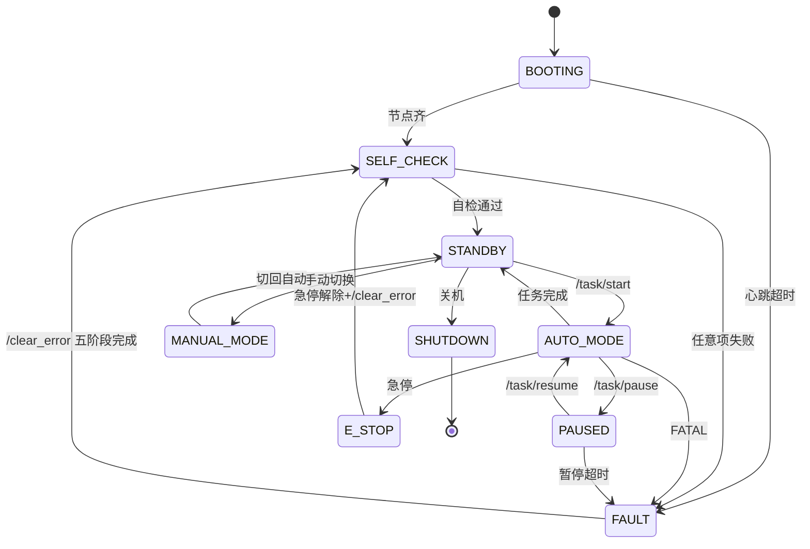

---

## 2. TaskFSM

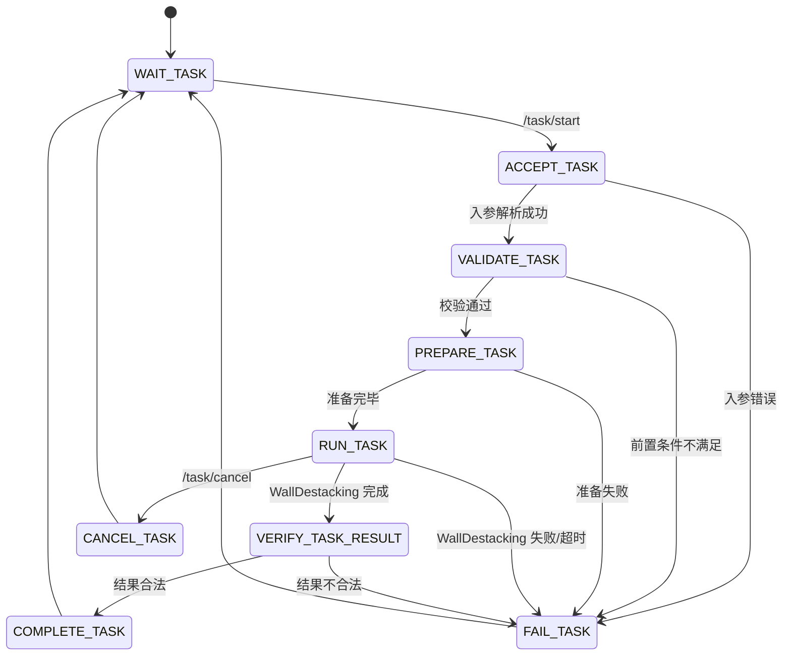

---

## 3. WallDestackingFSM（核心）

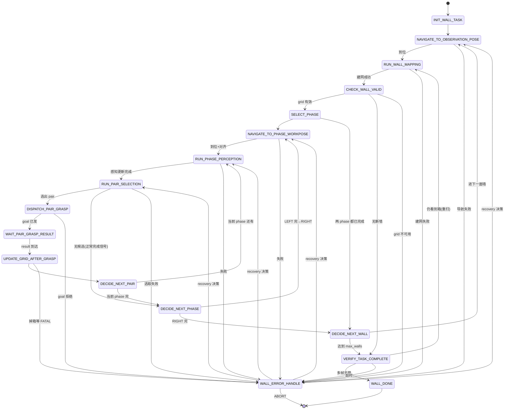

> WallDestackingFSM 主流程线性，但 WALL_ERROR_HANDLE 可跳回多个状态——具体由 WallRecoveryFSM 决定。

---

## 4. WallMappingFSM

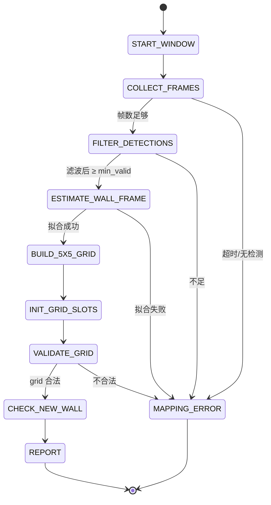

---

## 5. PhasePerceptionFSM

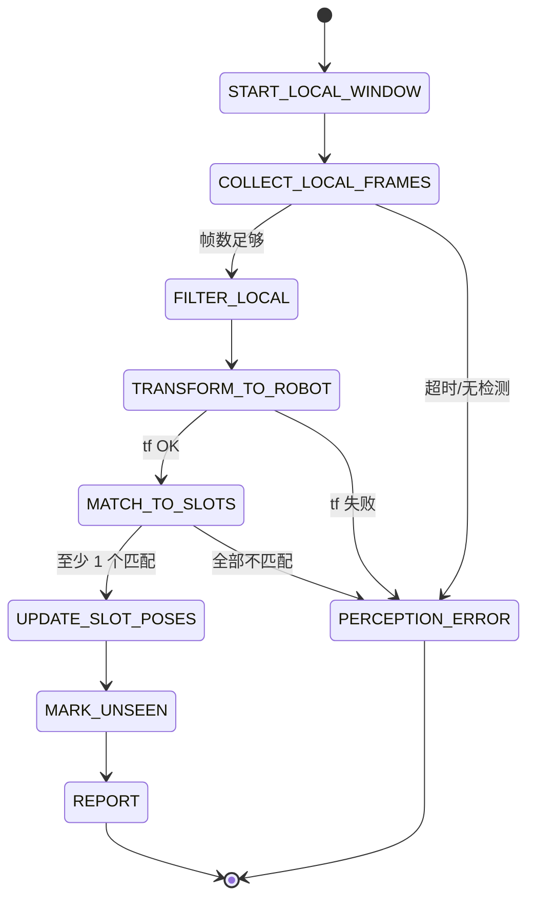

---

## 6. PairSelectionFSM

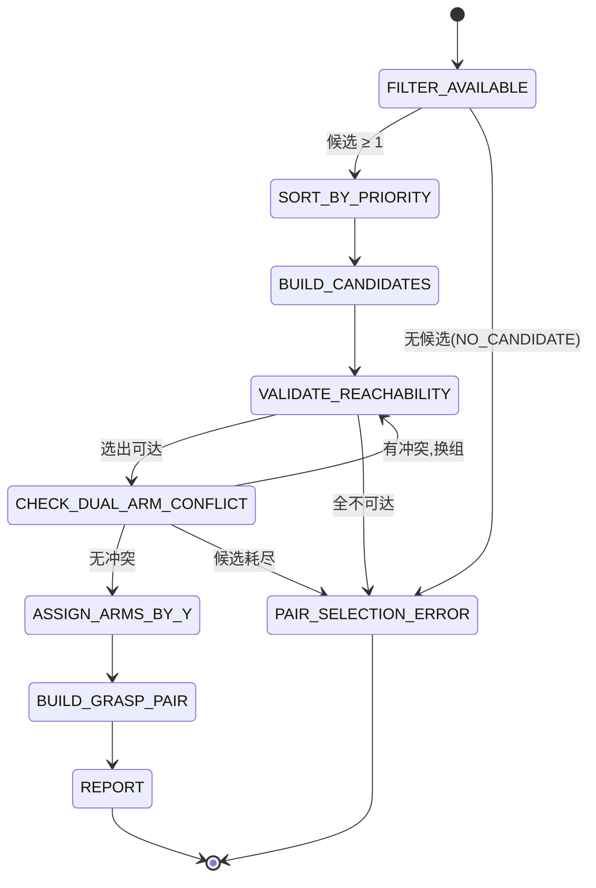

---

## 7. WallRecoveryFSM

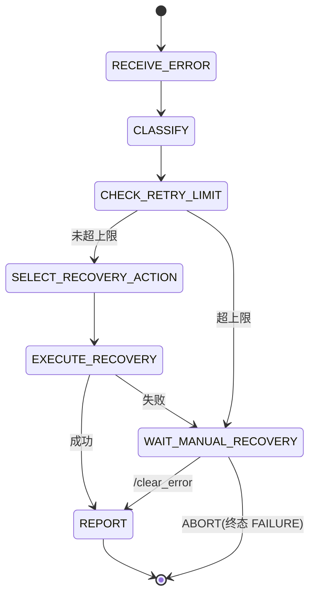

---

## 8. SafetyMonitorFSM

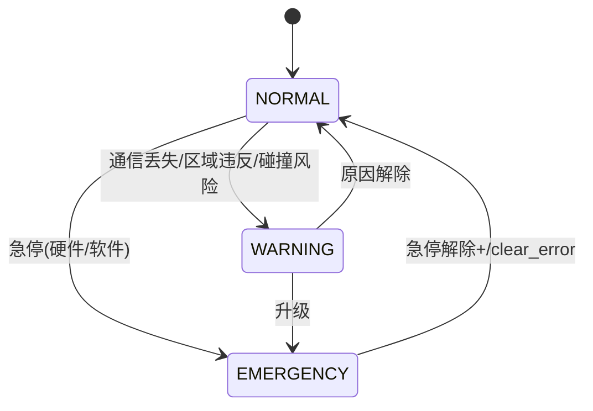

---

## 9. BaseNavigationFSM 推荐骨架（A 自定义）

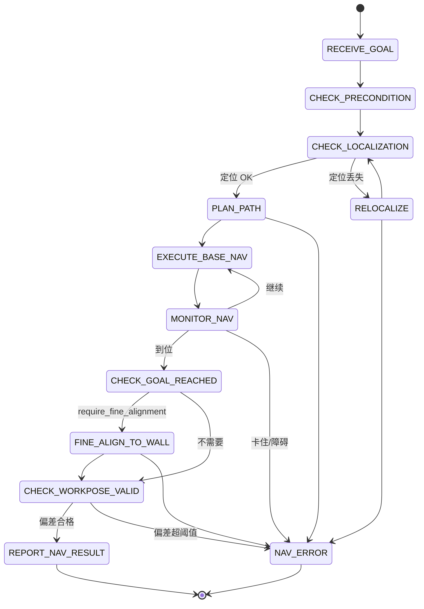

> 上图为推荐骨架，A 在实现时可调整内部状态名与跳转，但必须保证 Action Goal/Result 语义符合 03 接口契约。

---

## 10. PairGraspExecutionFSM 推荐骨架（B 自定义）

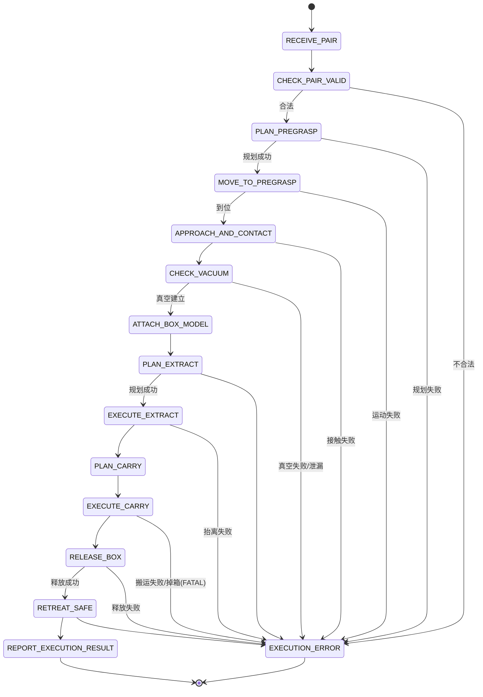

> 同上，B 可调整内部状态。Result 必须符合 03 接口契约里 PairGraspResult 的字段约束。

---

## 11. 三层 FSM 调用关系（系统视图）

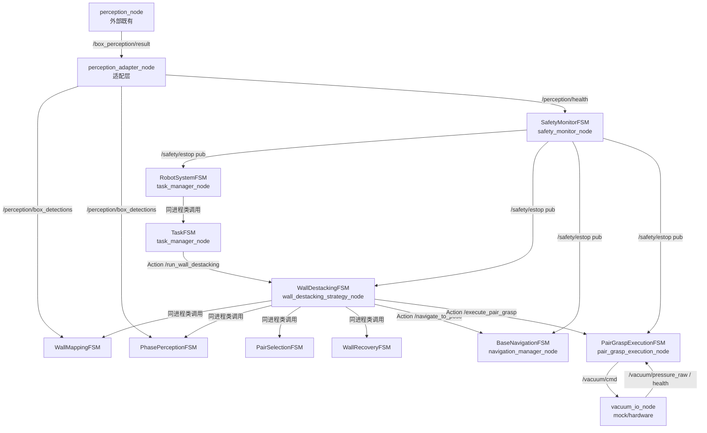

---

## 12. 数据流（一次完整 pair 抓取）

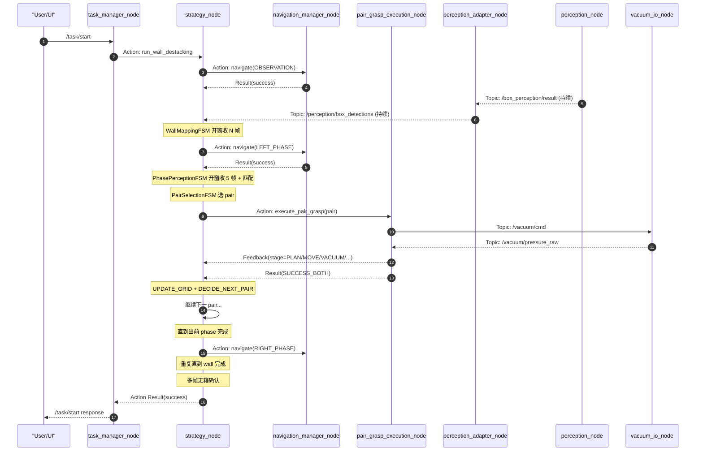

---

## 13. 版本

- v1.0 初版 2026-05-23
- 状态名变更必须同步改 02 状态规格手册与本文档的 Mermaid
