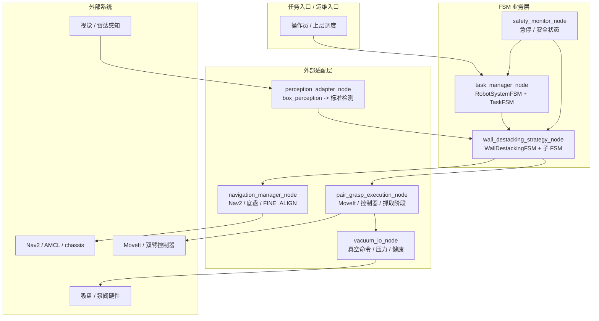
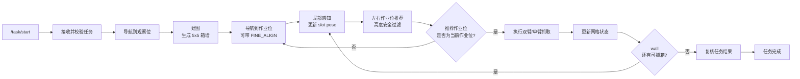
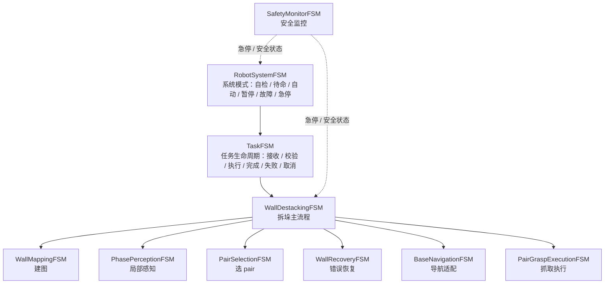
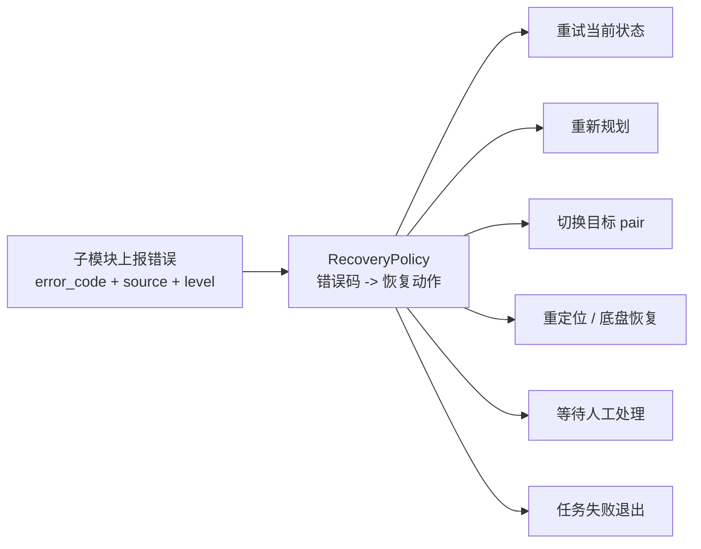
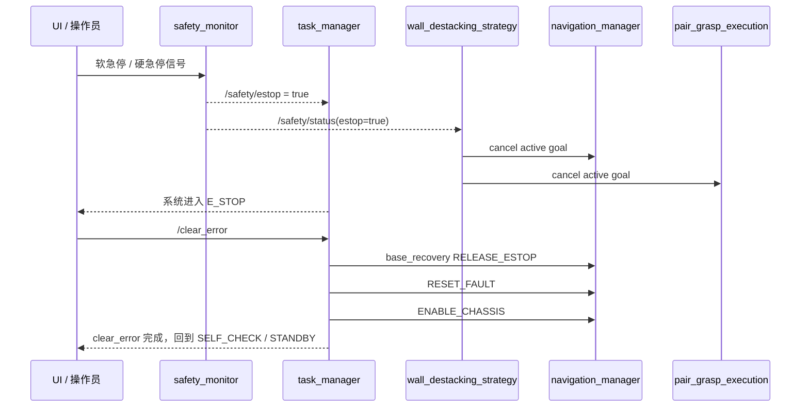

# Sevnova FSM 项目汇报

汇报主题：双臂拆垛任务的分层状态机、适配层和 mock-first 验证体系

---

## 1 分钟结论

Sevnova FSM 不是一个单点控制节点，而是一套面向真机落地的任务编排框架。它把拆垛任务拆成“任务调度、拆垛策略、导航适配、抓取执行、感知适配、真空 IO、安全监控”几个边界清晰的模块，先用 mock 跑通完整业务闭环，再逐步替换真实后端。

当前阶段可以概括为：

| 维度 | 当前状态 | 对汇报的意义 |
|---|---|---|
| 架构与接口 | `fsm_core`、`fsm_msgs`、配置、错误码和 launch 骨架已建立 | 多人并行开发有稳定边界 |
| M1 mock 闭环 | happy path、失败重试、急停、clear_error、取消任务等 smoke 已覆盖 | 已证明业务主流程可跑通 |
| M2 前置集成 | perception、navigation、grasp 的真实适配代码路径已进入 replay / fake_real / dry_run 验证 | 真实后端接入不是推倒重来 |
| 真机风险 | FINE_ALIGN、MoveIt/IK、真空硬件、现场 TF 和标定仍需 M2/M3 验证 | 后续风险集中在物理世界与外部系统 |

一句话价值：**先把业务状态、接口契约和异常恢复闭环固化，再用适配层逐步接入真实感知、导航、机械臂和吸盘，降低真机联调时的系统性风险。**

---

## 1. 项目要解决什么问题

双臂拆垛不是“发一个抓取指令”就能完成的任务。系统需要持续处理：

- 任务启动、暂停、取消、完成和失败。
- 对箱墙建图，按 5×5 网格维护箱体状态。
- 按左右作业位规划导航目标，每轮用列高度安全约束动态决定当前作业位是否继续抓取或切换。
- 从感知结果中选择可抓 pair，并分配左右臂。
- 调导航、抓取、真空、恢复等长耗时动作。
- 在急停、定位丢失、抓取失败、真空异常时进入可解释、可恢复的状态。

核心难点不是单个算法，而是**多模块之间的流程编排、异常隔离和现场可恢复性**。

---

## 2. 系统架构总览

系统采用“业务策略层 + 适配层 + 公共基础层 + 测试层”的拆分方式。

### 架构原则

| 原则 | 具体做法 | 收益 |
|---|---|---|
| adapter-first | FSM 不直接耦合 Nav2、MoveIt、上游感知或真空硬件 | 后端可替换，问题边界清晰 |
| mock-first | 先用 mock 跑通业务闭环，再逐步换真实后端 | 真机前先暴露流程和接口问题 |
| 接口先冻结 | `fsm_msgs`、错误码、配置和状态名先稳定 | A/B/策略三路可并行开发 |
| 安全独立 | `safety_monitor_node` 独立承担急停和安全状态 | 业务节点异常时不拖垮急停链路 |
| 状态可观测 | 关键 FSM 状态、日志、错误、网格和 pair 都广播 | 后续 UI、复盘和现场诊断可直接消费 |

---

## 3. 业务闭环怎么跑

一次完整拆垛任务可以理解为“建墙、进入作业位、局部感知、按列高度安全选 pair、必要时切换作业位、抓取、更新网格、循环直到完成”。

### 5×5 箱墙状态示意

系统不是只看“检测到几个箱子”，而是把箱墙维护成结构化网格。每个 slot 有状态、位姿、置信度、失败次数和是否被当前 pair 选中。

| 行 \ 列 | 0 | 1 | 2 | 3 | 4 |
|---|---|---|---|---|---|
| 0 | REMOVED | REMOVED | REMOVED | REMOVED | REMOVED |
| 1 | REMOVED | REMOVED | REMOVED | FAILED(1) | REMOVED |
| 2 | REMOVED | **PAIR-L** | **PAIR-R** | OCCUPIED | OCCUPIED |
| 3 | OCCUPIED | OCCUPIED | OCCUPIED | BLOCKED | OCCUPIED |
| 4 | OCCUPIED | OCCUPIED | UNKNOWN | OCCUPIED | OCCUPIED |

状态含义：

| 状态 | 含义 | 典型来源 |
|---|---|---|
| `OCCUPIED` | 该格有箱体，可作为候选 | 建图 / 局部感知 |
| `PAIR-L` / `PAIR-R` | 当前选中的左右抓取目标 | PairSelectionFSM |
| `REMOVED` | 抓取成功，箱体已移除 | PairGraspExecution 成功结果 |
| `FAILED(n)` | 抓取失败，已重试 n 次 | 抓取失败或真空异常 |
| `BLOCKED` | 暂不适合抓取 | 可达性、遮挡或策略约束 |
| `UNKNOWN` | 感知信息不足 | 感知窗口不足或置信度低 |

---

## 4. FSM 分层设计

系统不是一个巨大的状态机，而是分层状态机。这样做的目的，是把“任务生命周期”“拆垛策略”“子流程算法”“外部动作执行”分开。

### 核心状态机职责

| FSM | 职责 | 当前价值 |
|---|---|---|
| `RobotSystemFSM` | 维护系统级模式和急停 / 故障恢复 | 明确系统什么时候能接任务 |
| `TaskFSM` | 管理任务接收、校验、执行、完成、失败、取消 | 上层只关心任务语义，不关心内部抓取细节 |
| `WallDestackingFSM` | 串联建图、phase、pair、导航、抓取和更新 | 拆垛业务主线集中在一个策略层 |
| `WallMappingFSM` | 多帧感知融合，生成 5×5 网格 | 将感知输出转成业务可用结构 |
| `PhasePerceptionFSM` | 到工位后做局部感知更新 | 降低初始建图误差 |
| `PairSelectionFSM` | 从可用 slot 中选择左右抓 pair | 把策略选择和抓取执行解耦 |
| `WallRecoveryFSM` | 根据错误码决定 retry、replan、switch target、manual recovery | 异常路径可解释、可测试 |
| `BaseNavigationFSM` | 对接 Nav2、AMCL、FINE_ALIGN 和底盘恢复 | 屏蔽底盘和导航差异 |
| `PairGraspExecutionFSM` | 对接 MoveIt、控制器、真空和抓取阶段 | 屏蔽抓取实现差异 |
| `SafetyMonitorFSM` | 急停、安全状态和通信健康 | 独立安全闭环 |

---

## 5. 异常恢复链路

项目的重点不是只跑 happy path，而是明确失败之后怎么处理。错误通过统一错误码上报，再由恢复策略决定下一步。

### 典型异常示例

| 场景 | 错误码示例 | 恢复动作 | 业务效果 |
|---|---:|---|---|
| Nav goal rejected / timeout | 4000 / 4001 | 重试当前导航状态 | 短时导航异常不直接终止任务 |
| 定位丢失 | 4010 | 重定位 / 等待恢复 | 避免在错误位姿下继续抓取 |
| FINE_ALIGN 失败 | 4040 | 重试或切 recovery | 工位对齐失败可被定位 |
| pair 不合法 | 5010 | 切换目标 | 不让抓取执行处理脏数据 |
| 真空未达到 | 5105 | 重试当前 pair | 吸附失败可自动再试 |
| IK 失败 | 5200 | 切换目标 | 工作空间不可达时换箱 |
| 轨迹 / 碰撞失败 | 5201 / 5210 | 重新规划 | 规划问题不直接误判为业务失败 |
| 掉箱 | 5310 | 等待人工恢复 | 高风险场景进入保守处理 |

### 急停与 clear_error

急停不是普通失败。系统要求由 `safety_monitor_node` 统一产生安全状态，业务节点收到急停后取消正在执行的导航或抓取动作。解除后通过 `clear_error` 协议回到可运行状态。

---

## 6. 当前进展

截至 2026-05-27，项目已经从“设计文档”推进到“可构建、可测试、可 mock 闭环，并开始真实适配前置验证”的阶段。

### 里程碑状态

> 注：上图按 2026-05-27 的当前能力快照表达。原计划排期仍以 `docs/09_任务拆解.md` 为准；其中 M1 原计划从 2026-05-30 开始，但当前仓库已经形成 mock 闭环验证快照。M2-preintegration 是无真机条件下的前置验证，不等同于 M2 真机验收完成。

### 已经具备的能力

| 模块 | 已完成能力 | 验证方式 |
|---|---|---|
| `fsm_core` | FSM 引擎、状态基类、错误码、恢复策略、广播和日志基础能力 | L0 单测 / import / colcon build |
| `fsm_msgs` | msg / srv / action 契约 | ROS interface / build |
| `task_manager` | 系统状态、任务状态、`/task/*`、`/clear_error` 主线 | L1/L2/L3 smoke |
| `wall_destacking_strategy` | 父 FSM、建图、局部感知、pair 选择、错误恢复、抓取调度 | mock bringup smoke |
| `mock_navigation_manager` | 导航 happy path、FINE_ALIGN 模拟、失败注入、急停响应 | L2-NAV smoke |
| `mock_pair_grasp_execution` | 14 阶段反馈、dry_run、cancel、急停、失败注入 | L2-GRASP smoke |
| `mock_perception_adapter` | 多种感知模式和故障注入 | L2-PERC smoke |
| `vacuum_io` | mock 真空曲线、health、故障注入 | L2-GRASP / vacuum smoke |
| `safety_monitor` | NORMAL / WARNING / EMERGENCY、急停和恢复 | L2-SAFETY smoke |

### M2-preintegration 进展

| 范围 | 当前状态 | 已验证 | 仍需后续验证 |
|---|---|---|---|
| perception_adapter | 已接 `box_perception_msgs`，可订 `/box_perception/result`，TF2 转 `base_link`，health 兜底 | `scripts/m2_pre_perception_replay_smoke.py` | 真实 box_perception 数据链路 |
| navigation_manager | 已接 Nav2 Action client、lifecycle、AMCL covariance、costmap clear、chassis reset/enable、cancel 透传 | `scripts/m2_pre_nav_fake_real_smoke.py` | 真实 Nav2 / chassis / FINE_ALIGN 闭环 |
| pair_grasp_execution | 已实现 14 阶段主线、GraspPair 校验、dry_run / fake_real / real MoveGroup Action 骨架、cancel / estop | `scripts/m2_pre_grasp_fake_real_smoke.py` | L3-SIM-03 轻量物理第一版 / 真机 dry-run / 真空硬件 |
| M1 回归 | mock bringup 与单测继续保留 | `scripts/m1_mock_bringup_smoke.py`、`colcon test --packages-select fsm_test` | 每次替换真实后端后继续回归 |

---

## 7. 参考材料

本汇报稿基于仓库内已有文档整理：

- `README.md`：项目目标、当前状态和快速开始。
- `docs/01_系统架构与代码骨架.md`：节点划分、线程模型、Context 和状态广播。
- `docs/02_状态规格手册.md`：各 FSM 状态规格。
- `docs/03_接口契约.md`：Topic、Service、Action 和消息字段。
- `docs/04_错误码与恢复策略表.md`：错误码和恢复动作。
- `docs/06_状态机Mermaid图集.md`：状态机图集。
- `docs/07_Mock规格与测试用例.md`：mock 节点和测试分层。
- `docs/08_UI.md`：长期 UI 定位和边界。
- `docs/09_任务拆解.md`：M0-M4 计划、当前进展和风险登记。
- `docs/10_navigation_manager_设计笔记.md`：导航适配当前状态和风险。
- `docs/11_pair_grasp_execution_设计笔记.md`：抓取执行当前状态和风险。
- `docs/12_M2离线预集成计划.md`：M2-preintegration 策略和验收。
